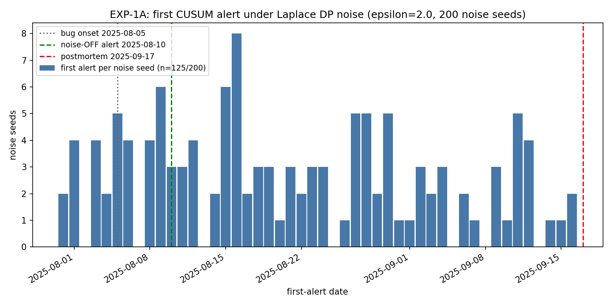

# EXP-1A: DP-Noise-ON Backtest -- Anthropic Claude Sonnet 4

**Script:** `scripts/experiment_dp_backtest.py` | **Data seed:** 42 |
**Noise seeds:** N=200 (master seed 1337) | **CUSUM:** h=5.0, k=0.5,
baseline=30

---

## Question

The noise-OFF backtest (`scripts/anthropic_backtest.py`) shows that a
seeded backtest flags the Aug-Sep 2025 Claude Sonnet 4 silent
degradation **38 days before the official postmortem** (first alert
2025-08-10). That simulation feeds raw daily metrics to the CUSUM
detector. Live probes do not transmit raw metrics: every flushed
metric carries Laplace differential-privacy noise
(`probe/privacy.py`, epsilon=2.0 per flush). Does the detection
result survive the DP noise?

## Method

- **Data.** The exact noise-OFF daily series is regenerated by
  importing `simulate_day` and all timeline constants from
  `scripts.anthropic_backtest` (data seed 42; 2025-07-01 to
  2025-09-17; bug onset 2025-08-05 at ~0.8% misrouting; escalation
  2025-08-29 at ~16%).
- **Noise.** One SignalBatch flush per simulated day. Laplace noise
  applied per metric with scale `b = delta_f / epsilon`, mirroring
  `Aggregator.flush()` exactly: same draw order, same clamps
  (length >= 0; rate in [0, 1]), same 4-decimal rounding.
- **Trials.** 200 independent noise seeds derived from a fixed
  master seed (1337); the noise RNG is fully separate from the data
  RNG. Fully reproducible: re-runs produce byte-identical stdout.
- **Control (sanity gate).** The noise-OFF series run through the
  same harness reproduces the canonical first alert **2025-08-10**
  exactly; the script raises if it does not.
- **Null control.** The same 200 noise seeds are also run over a
  counterfactual no-bug series (phase 0 on every day, same data
  seed). Any alert on the null series is a false alarm by
  construction.

## delta_f provenance (verbatim from `probe/privacy.py`)

Both sensitivities are defined in the live DP path; no assumed
values were needed.

| Constant | Value | Source |
|---|---|---|
| `EPSILON` | 2.0 | `probe/privacy.py` line 74 |
| `MAX_OUTPUT_LENGTH` | 8192 | line 75 |
| `_METRIC_SENSITIVITY["avg_output_length"]` | 8192.0 | lines 77-78 |
| `_METRIC_SENSITIVITY["json_success_rate"]` | 1.0 | line 79 |
| Scale `b = delta_f / EPSILON` applied in `flush()` | b_len=4096.0, b_rate=0.5 | lines 575-594 (draws at 580, 590) |

Note: these are the Phase-0 *conservative global-max* bounds. The
module itself flags this (`NOTE(REQ-PRIV-010)`, lines 18-19):
Phase 1 plans to refine sensitivity to `delta_f = MAX / n` for
batches of n results, which shrinks the noise by the batch size.

## Results

| | Noise-OFF (canon) | DP-noise-ON (200 seeds) |
|---|---|---|
| First alert | 2025-08-10 | see distribution below |
| Seeds alerting before 2025-09-17 | 1/1 | 125/200 (62.5%) |
| -- via `json_success_rate` | yes (first) | 80 |
| -- via `avg_output_length` | -- | 71 |
| Pre-onset alerts (< 2025-08-05) | 0 | 12 |
| First alert on 2025-09-17 (not counted) | -- | 5 |
| No alert at all | 0 | 70 |
| **No-bug null control alerting** | -- | **113/200 (56.5%)** |

First-alert date distribution, alerting seeds only (n=125):

| min | median | p90 | max |
|---|---|---|---|
| 2025-07-31 | 2025-08-19 | 2025-09-11 | 2025-09-16 |

- Median delay vs the noise-OFF alert (2025-08-10): **+9 days**
- Median lead vs the postmortem (2025-09-17): **29 days**

## Interpretation (honest reading)

**The headline number is the null control, not the detection
rate.** 62.5% of seeds alert with the bug present, but 56.5% alert
on a series with *no bug at all*. The ~6 pp excess is within
sampling error at N=200 (binomial 95% CI is roughly +/-7 pp).
Under the shipped Phase-0 DP constants, single-probe daily-flush
detection is statistically indistinguishable from the false-alarm
process, and the conditional date statistics above (median
2025-08-19, 29-day lead) must **not** be quoted as detection lead
times -- most of those alerts are noise-driven.

Mechanically: the rate channel adds Laplace(b=0.5) noise to a
signal whose bug-induced shift is 0.008-0.15 in absolute terms,
and the length channel adds Laplace(b=4096) to a shift of a few
hundred tokens. Both scale factors exceed the signal by one to
three orders of magnitude, so the CUSUM baseline absorbs the noise
into sigma0 and the drift never accumulates faster than the false
alarms it competes with.

**What this means for the methodology paper:** the noise-OFF
result -- a seeded backtest flags it 38 days before the postmortem
-- does not carry over to a single probe transmitting under the
Phase-0 conservative sensitivity bounds. Recovering detection
under DP requires at least one of:

1. the planned `delta_f = MAX / n` refinement (REQ-PRIV-010): at
   n=100 results/flush, b_len drops 4096 -> ~41 and b_rate
   0.5 -> 0.005, both below the per-phase signal shifts;
2. aggregation across the up-to-5 daily flushes the budget
   (10.0 / 2.0) already permits;
3. cross-observer aggregation at the gateway before the detector
   (independent Laplace draws average down as 1/sqrt(m)).

## Limitations

1. **Synthetic data.** Same caveat as the noise-OFF backtest: the
   timeline is synthesized from the public postmortem; real probe
   noise may differ.
2. **One flush per day.** Live probes may flush up to 5x/day
   within the daily epsilon budget; more (noisier) observations
   per day were not modeled.
3. **Single observer.** No AgreementScorer quorum was modeled.
   Quorum >= 2 would suppress the independent false alarms seen
   here, but at this per-probe SNR it would suppress true
   detections just as effectively.
4. **Conservative sensitivities by design.** This experiment uses
   the shipped Phase-0 constants verbatim. The negative result is
   a statement about those constants, not about DP at epsilon=2.0
   per se; see the REQ-PRIV-010 refinement path above.
5. **Detection-rate definition.** "Alerting" counts a first alert
   strictly before 2025-09-17 on either metric; it does not
   distinguish bug-driven from noise-driven alerts. The null
   control exists precisely to expose that gap.

---

*Reproduce: `python3 scripts/experiment_dp_backtest.py`
(stdout is byte-identical across runs; figure regenerated at
`docs/experiments/dp_backtest_hist.png`).*
