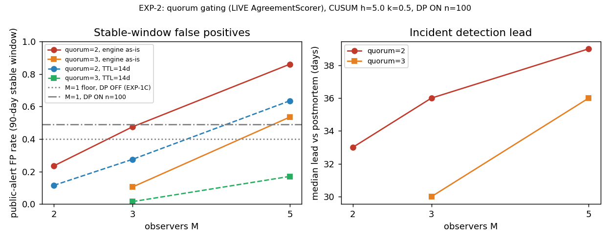

# EXP-2: Multi-Observer Quorum Simulation

**Generated:** 2026-07-15 | **Trials:** 200 per condition, master-seeded |
**Detector:** CUSUM h=5.0, k=0.5, baseline_samples=30 (per observer) |
**DP:** ON, Laplace epsilon=2.0, n_batch=100

Reproducible: `python3 scripts/experiment_quorum.py` (stdout is
byte-identical across re-runs; verified by diff).

---

## The Question

EXP-1C established that a single observer at the default operating point
has a **0.400** false-positive rate on a 90-day stable window (DP OFF;
0.49 DP ON at n=100, measured below). The architecture's answer is the
correlation-first invariant: *a single-org signal is never promoted to a
public drift alert*. This experiment demonstrates that invariant
end-to-end through the **live engine code**, and quantifies what quorum
gating buys (FP suppression) and what it costs (detection delay).

## Method

### Engine code exercised (not reimplemented)

| Component | Role |
|---|---|
| `engine.correlation.AgreementScorer` | LIVE quorum gate: `ingest()` + `promote_to_public_alert()`. Promotion requires >= quorum distinct `org_id`s with `change_detected=True` per `model_tuple`. `QUORUM_MIN=2` is the production default. |
| `engine.correlation.ChangePointResult` | Candidate-alert envelope fed to the scorer. |
| `engine.detector.CUSUMDetector` | One instance per observer; per-(model_tuple, metric) Page-CUSUM, exactly the `anthropic_backtest.py` configuration. |
| `probe.privacy._metric_sensitivity`, `_laplace_noise`, `EPSILON` | DP noise identical to `Aggregator.flush()` post-processing (draw order, clamping, 4-decimal rounding). |
| `scripts.anthropic_backtest.simulate_day` | Canonical seeded incident generator (baseline 2025-07-01, bug 2025-08-05, escalation 2025-08-29, postmortem 2025-09-17). |
| `scripts.experiment_stable_fp.run_window` / `synth_stable_window` | Reused verbatim for the M=1 sanity gate. |

Nothing in the scoring or promotion decision was reimplemented. The
harness supplies only: observer simulation, daily
`promote_to_public_alert()` polling, and (for one labelled variant)
candidate expiry — see the defect note below.

### AgreementScorer semantics (found by reading the live code)

1. **No time-window matching.** Pending candidates accumulate until
   `clear()`; two candidates 89 days apart still form quorum. The
   primary ("engine as-is") condition uses one persistent scorer polled
   daily — the worst case for coincidence false positives. A second
   condition enforces a **14-day candidate TTL in the harness** (fresh
   scorer per day, re-ingesting only the last 14 days of candidates;
   the promotion decision is still the real scorer). The TTL is a
   proposed engine fix, not existing engine behaviour.
2. **No weighting.** Observers are equal-weight; no reputation.
3. **No metric/direction matching.** `ChangePointResult` carries no
   metric name; orgs alerting on different metrics or in opposite
   directions still count as agreement.

### Observer model

M independent observers (M in {2, 3, 5}). Each observer has its own
data RNG (independent Gaussian draws around the **same** phase means —
same provider truth, independent sampling), its own DP-noise RNG, and
its own `CUSUMDetector`. DP is ON with **n_batch=100** records per
daily flush (`SG_N_BATCH` overrides): a realistic canary batch — a
probe running a ~100-prompt suite once per day — rather than the
worst-case n=1 bound of EXP-1. Noise scales: b=40.96
(avg_output_length), b=0.005 (json_success_rate). An observer's
*candidate* alert is its first `DriftAlert` on any metric stream; it is
ingested as a `ChangePointResult` with that observer's `org_id`.

### Sanity gate (passed)

M=1, DP OFF, EXP-1C condition-1 construction (imported, not copied):
**0.4000** — reproduces the published EXP-1C rate exactly. The EXP-2
conditions below run DP ON at n=100, where the measured M=1 candidate
FP rate is **0.4900** (200 windows; 0.5160 pooled over 1000
observer-windows). That is the relevant single-observer comparison
floor for Experiment B.

---

## Experiment A — Incident timeline (detection and lead)

200 trials of the canonical incident timeline. For reference, the
single-observer canonical run: a seeded backtest flags it 38 days
before the postmortem. Public-alert detection rate before 2025-09-17
was **1.0000 for every (M, quorum)** condition.

| M | quorum | first public alert min / median / p90 / max | median lead vs postmortem | median first candidate | quorum cost |
|---|---|---|---|---|---|
| 2 | 2 | 2025-08-06 / 2025-08-15 / 2025-08-29 / 2025-08-29 | 33 days | 2025-08-09 | 6 days |
| 3 | 2 | 2025-08-04 / 2025-08-12 / 2025-08-19 / 2025-08-29 | 36 days | 2025-08-08 | 4 days |
| 3 | 3 | 2025-08-06 / 2025-08-18 / 2025-08-29 / 2025-08-29 | 30 days | 2025-08-08 | 10 days |
| 5 | 2 | 2025-08-04 / 2025-08-09 / 2025-08-13 / 2025-08-18 | 39 days | 2025-08-07 | 2 days |
| 5 | 3 | 2025-08-06 / 2025-08-12 / 2025-08-17 / 2025-08-24 | 36 days | 2025-08-07 | 5 days |

Quorum cost = median public-alert day minus median first
single-observer candidate day. At the production default (quorum=2)
the cost is 2-6 days; raising quorum to 3 costs 5-10 days. All medians
remain 30+ days ahead of the postmortem date on this seeded timeline.

TTL=14d check (quorum=2): detection rate stays 1.0000 for M=3 and M=5.
M=2 drops to 0.7950 — an artifact of the one-candidate-per-observer
model: if one observer spends its single candidate on a pre-incident
false alarm, expiry prevents it from pairing later. In production the
detector resets and re-fires during a real incident (REQ-ENGINE-011),
so this row understates TTL detection; noted, not corrected.

---

## Experiment B — Stable window (headline: public-alert FP rate)

90-day stable window (2025-05-07..2025-08-04, all phase 0), 200
trials. Single-observer floors: 0.400 (DP OFF, EXP-1C) and 0.4900
(DP ON n=100, this experiment's condition).

| M | quorum | public FP (engine as-is) | public FP (TTL=14d) |
|---|---|---|---|
| 1 | -- | 0.4900 (candidate rate) | 0.4900 |
| 2 | 2 | **0.2350** | 0.1150 |
| 3 | 2 | 0.4750 | 0.2750 |
| 3 | 3 | **0.1050** | **0.0150** |
| 5 | 2 | 0.8600 | 0.6350 |
| 5 | 3 | 0.5350 | 0.1700 |

Findings, stated plainly:

- Quorum gating works as designed at M=2/quorum=2: 0.4900 -> 0.2350,
  roughly the product of independent per-observer rates, because both
  observers must fire somewhere in the window.
- **Defect (design gap, quantified): with no candidate expiry, fixed
  quorum=2 gets *worse* as the network grows.** At M=5/quorum=2 the
  public FP rate is 0.8600 — above the single-observer floor — because
  any two of five observers false-alarming anywhere in 90 days
  eventually coincide in the never-expiring pending buffer.
- Both mitigations are quantified: quorum=3 at M=3 gives 0.1050
  as-is; adding a 14-day candidate TTL gives **0.0150**. Recommendation
  for the Phase 1 open decision in `AgreementScorer`: raise quorum with
  network size *and* add candidate expiry to the engine.

---

## Experiment C — Adversarial (constitution-required)

### C1: Single-org correlated noise burst (M=3, quorum=2)

A strong shift (-0.06 on `json_success_rate`, 10x phase-0 sigma, days
45-64) injected into ONE observer's series only. Burst observer
candidate rate: 1.0000 (asserted per trial).

- **Invariant HELD:** in all 37 trials where both honest observers
  stayed quiet, zero public alerts — the burst candidate stayed
  private (asserted per trial, any violation aborts the run).
- Residual: public-alert rate 0.8150 with burst vs 0.2750 without
  (same seeds). The +0.5400 delta is the burst pairing with >= 1
  honest observer's *independent* false alarm at quorum=2 — the same
  residual channel as C2, measured under identical semantics.
  TTL=14d reduces it to 0.5500.

### C2: Sybil-lite (M=3: 2 honest + 1 always-alerting Sybil)

One malicious org emits a fabricated `ChangePointResult` every day for
90 days.

- **Sybil alone never promotes** (asserted): one org_id, however loud,
  cannot reach quorum — `AgreementScorer` counts distinct org_ids.
- In all 36 trials where both honest observers stayed quiet, zero
  public alerts (asserted).
- **Honest residual risk, quantified:** with quorum=2, the Sybil
  colludes with any single honest false alarm; on stable windows that
  coincidence occurred in **0.8200** of trials (~= P(>=1 of 2 honest
  observers false-alarms in 90 days)). Raising quorum to 3 (Sybil + 2
  honest false alarms required) drops it to **0.3400**. A TTL does not
  help against this channel — the Sybil is always "fresh". This is the
  known residual that reputation weighting and Ed25519 org binding
  (Phase 2, gateway key registry) are designed to address; neither is
  exercised here.

---

## Known Limitations

1. **Synthetic independence assumption.** Observers here are
   statistically independent given the provider truth. Real observers
   share provider infrastructure (same routing tiers, same regional
   backends), so their noise — and their false alarms — may correlate.
   Correlated observers make quorum FP rates *worse* than reported and
   the C1/C2 residual channels wider. All quorum-benefit numbers here
   are therefore optimistic.
2. **Equal-weight observers; no reputation weighting exercised.** The
   live `AgreementScorer` has no weighting, so none was simulated. The
   C2 collusion rate is exactly the number reputation weighting exists
   to reduce.
3. **TTL variant is harness-enforced.** The engine has no candidate
   expiry; the TTL=14d numbers describe a *proposed* fix, exercised
   through the real scorer but with expiry logic outside it.
4. **One candidate per observer per window.** Streams stop after their
   first alert (EXP-1C convention). No reset-and-refire, which
   understates TTL-condition detection (see Experiment A note) and
   slightly understates as-is FP coincidence.
5. **Synthetic generator, one flush/day, h/k not recalibrated.** Same
   caveats as EXP-1: phase means from the public postmortem, Gaussian
   noise, h=5.0/k=0.5 Phase-0 defaults; real probe traffic differs.

---

*Files: `scripts/experiment_quorum.py`,
`docs/experiments/quorum_fp_vs_m.png`.*
